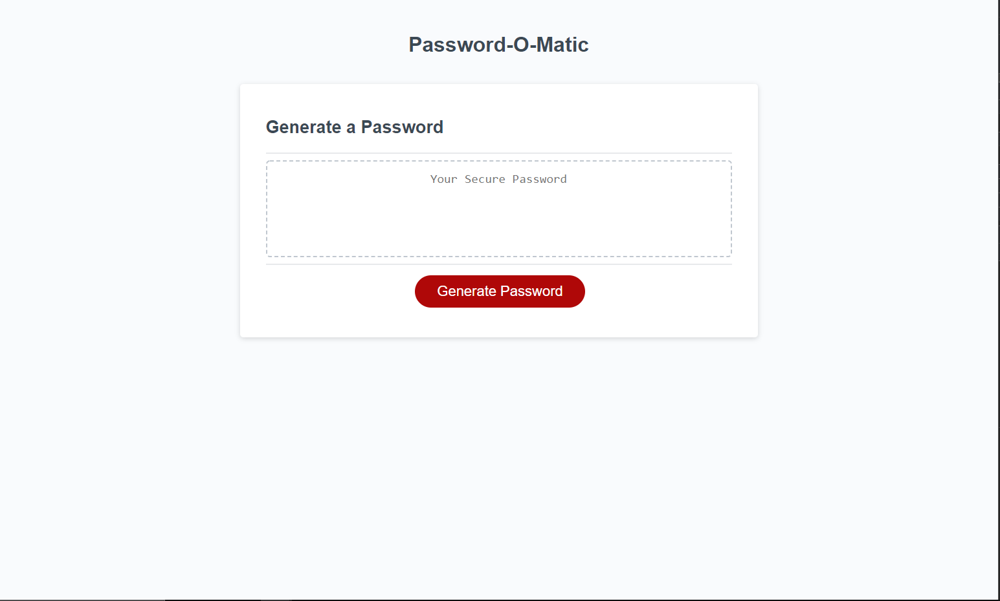

# Password-o-Matic
Working with JavaScript to create a password generator. 

Very new to JavaScript and this is my first time really utilizing it! 

    Shout-Out! ----> https://www.youtube.com/watch?v=duNmhKgtcsI
    Watched this video to help plan on how to execute the project. Very well done tutorial. I included a separate .js file I used to follow along. Along with general googling I learned quite a bit and helped me understand the logic better. It's a much different approach than I was planning but I did incorporate some into my generator. 
